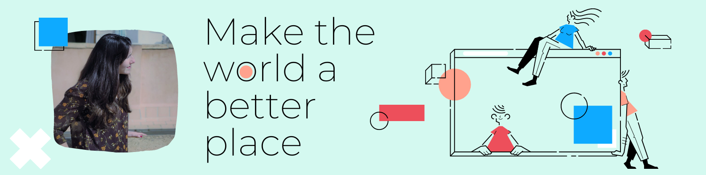
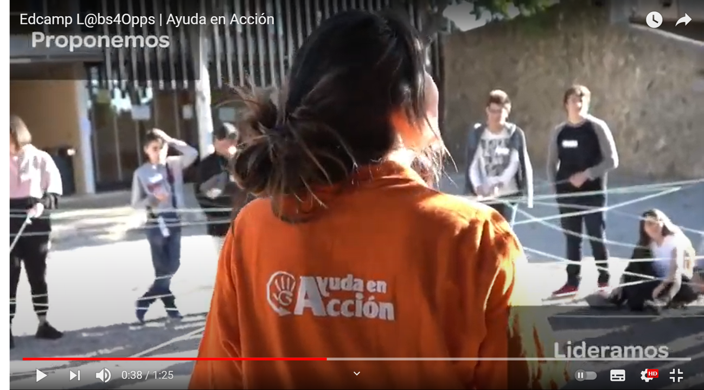

## ¡Hola mundo!

Cuántas veces habré dicho esto... Hace más de 3 décadas, lo dije con un llanto, o eso me han contado. Cuando me licencié como psicóloga, lo grité a los cuatro vientos, birrete en mano. Ahora lo digo de nuevo, entre llaves, funciones y componentes -con ojos, oídos y mente bien despiertos- para recoger toda sugerencia o propuesta de quienquiera que se asome a mi código, y me quiera ofrecer alguna.

Soy junior en el mundo de la programación, a la vista está. Sin embargo, mi recorrido como profesional de la mente humana y como creadora de proyectos educativos en organizaciones sociales, me precede. Formación y experiencia de las que me siento orgullosa, como poco. Algunos testigos hay...

<a target="_blank" href="https://youtu.be/LaGT7VlIF4o" text-align="center">
</a>

Hoy enfrento un nuevo reto en mi vida, el de sumergirme en el sector tecnológico, reinventada y motivada; lógico para quienes me conocen y aventurado para los que no tanto. Sea como fuere, mi energía, autodetermiación y compromiso con aquello que me ha traído hasta aquí, sé que me llevarán allí a donde quiero llegar.

Hasta entonces, seguiré nutriendo mi saber y cultivando mi código. Porque quien siembra... 🐾🌱

STACK TECNOLÓGICO

©CrisBIB una desarrolladora front-end criada en Madrid, con raíces castellano-manchegas, que disfruta viviendo en Palma de Mallorca.

