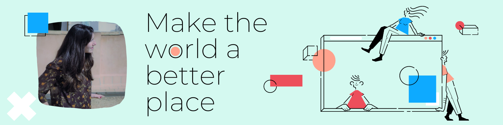

### ¡Hola mundo!

Cuántas veces habré dicho esto... Y hoy cobra un nuevo sentido. Hace más de 3 décadas, lo dijo con un llanto, o eso me han contado. Cuando me licencié como psicóloga, lo grité a los cuatro vientos, birrete en mano. Ahora se le digo a la comunidad tecnológica y a toda persona que quiera ojear mi trabajo, entre llaves y corchetes.

<!--
**CrisBIB/CrisBIB** is a ✨ _special_ ✨ repository because its `README.md` (this file) appears on your GitHub profile.

Here are some ideas to get you started:

- 🔭 I’m currently working on ...
- 🌱 I’m currently learning ...
- 👯 I’m looking to collaborate on ...
- 🤔 I’m looking for help with ...
- 💬 Ask me about ...
- 📫 How to reach me: ...
- 😄 Pronouns: ...
- ⚡ Fun fact: ...
-->
